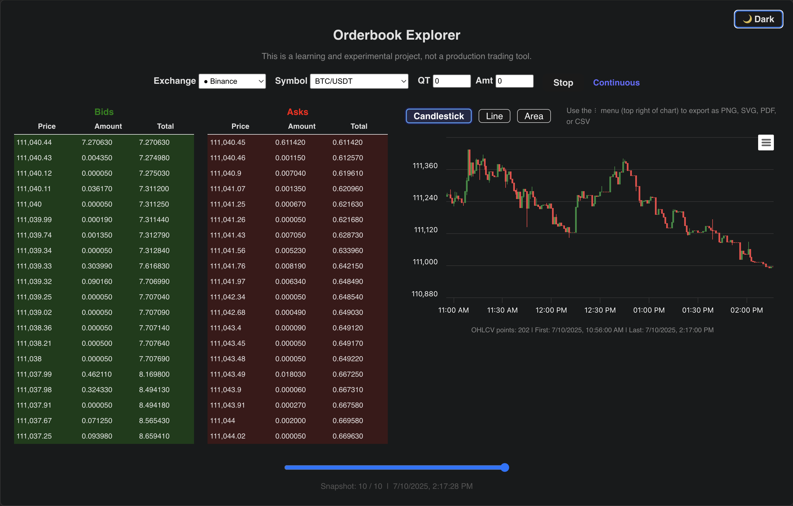
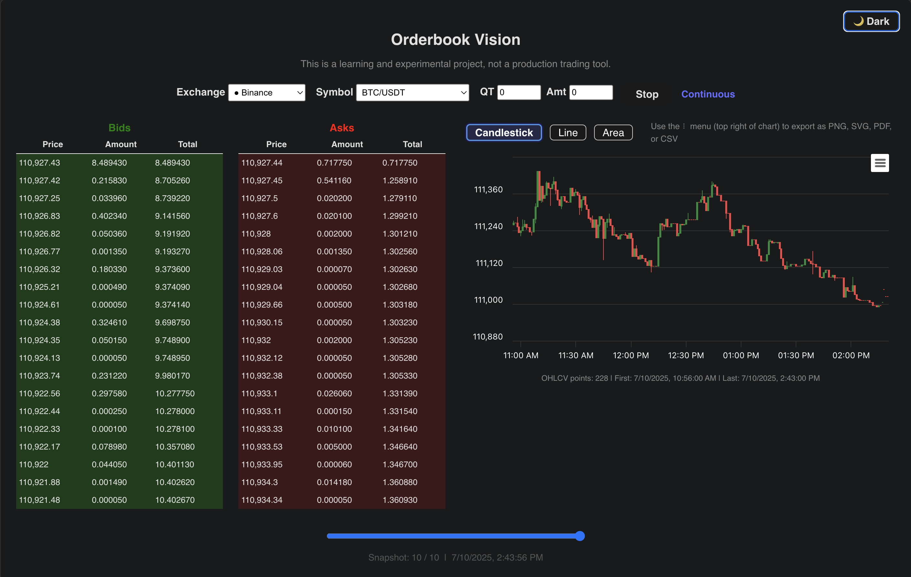

# Orderbook Vision

Orderbook Vision is a full-stack, open-source crypto order book and chart explorer. This project is not a finished product or a professional trading tool—it's a learning journey, a sandbox for experimentation, and a humble step in my ongoing fintech development.

---

## Why This Project?

I built Orderbook Vision as part of a conscious, step-by-step upscaling in fintech and web development. My goal is not to create a perfect app, but to:
- **Learn** by doing, making mistakes, and iterating
- **Document** my progress and share my progress
- **Experiment** with new technologies, libraries, and UI/UX patterns
- **Showcase** how a project can evolve from minimal to advanced, with each repo as a milestone

This repo is the latest in a series, and each one is intentionally kept separate to make my learning progression transparent. I want others to see not just the end result, but the path, the pivots, and the lessons along the way.

---

## UI Screenshots

Light mode:

Dark mode:

---

## Features (So Far)

- **Live order book for any supported CCXT exchange and symbol**  
  Instantly fetches and displays the real-time order book for your chosen exchange and trading pair. The UI is responsive and updates smoothly, with robust error handling for unsupported or offline exchanges.

- **Advanced charting: candlestick, line, area (with zoom, pan, export, tooltips, and theme)**  
  The chart is powered by Highcharts, offering interactive candlestick, line, and area views. You can zoom and pan with your mouse, and tooltips provide detailed OHLCV data. The chart adapts to both light and dark mode, and is visually clearer and more interactive than in previous versions.

- **Export chart and data: PNG, SVG, PDF, or CSV (via built-in export menu)**  
  Easily export the current chart as an image (PNG, SVG, PDF) or download the raw data as CSV. The export menu is built-in and works seamlessly in both light and dark mode—no extra setup required.

- **Light/dark mode (auto and manual toggle)**  
  The entire UI, including the chart, switches instantly between light and dark themes. Colors, backgrounds, and chart elements are all theme-aware for maximum readability and comfort.

- **Responsive, minimal, professional UI**  
  The layout is fully responsive for desktop, tablet, and mobile. The design is intentionally minimal and modern, with a focus on clarity and usability.

- **Growing chart: chart accumulates new data over time (does not reset)**  
  Unlike previous versions, the chart now grows as new data arrives, letting you see price action over your entire session. Data is deduplicated and never resets unless you change the exchange or symbol.

- **Snapshot slider for historical order book views**  
  Use the slider to view historical snapshots of the order book, making it easy to analyze how liquidity and depth change over time.

- **Robust error handling and user experience**  
  Errors are clearly displayed, loading states are handled gracefully, and the app avoids blank screens or crashes. The experience is much smoother and more reliable than earlier versions.

> **Note:** This project is for educational and experimental purposes only. It is not a production trading tool, and I make no guarantees about reliability, security, or completeness.

---

## The Learning Journey: Why So Many Repos?

You might wonder: why not just one repo with a long commit history? The answer is intentional: I want to make my learning process visible and accessible. Each repo in this series represents a major milestone, a new lesson, or a significant refactor. This approach:
- Makes it easy to see my progression and learning over time
- Keeps each stage focused and clean (no overwhelming commit history)
- Allows others to follow along, fork, or learn from any stage
- Encourages me to reflect on what I've learned and what I still need to improve

### Previous repos in this series:
- [orderbook-viewer (original/minimal)](https://github.com/vedangp/orderbook-viewer)
- [orderbook-explorer (intermediate, with more features)](https://github.com/vedangp/orderbook-explorer)

This repo is the **advanced edition**, with full charting, UX, and fintech best practices. But it's still just a step—there's always more to learn.

---

## Getting Started
1. `npm install` in both `backend` and `frontend`
2. Start backend: `cd backend && npm run dev` (or `node index.js`)
3. Start frontend: `cd frontend && npm run dev`
4. Open [http://localhost:5173](http://localhost:5173)

---

## License
MIT (for learning and non-commercial use)

---

**Thank you for checking out Orderbook Vision. If you have feedback, suggestions, or want to share your own learning journey, please open an issue or reach out. This project is a work in progress, and so am I.** 