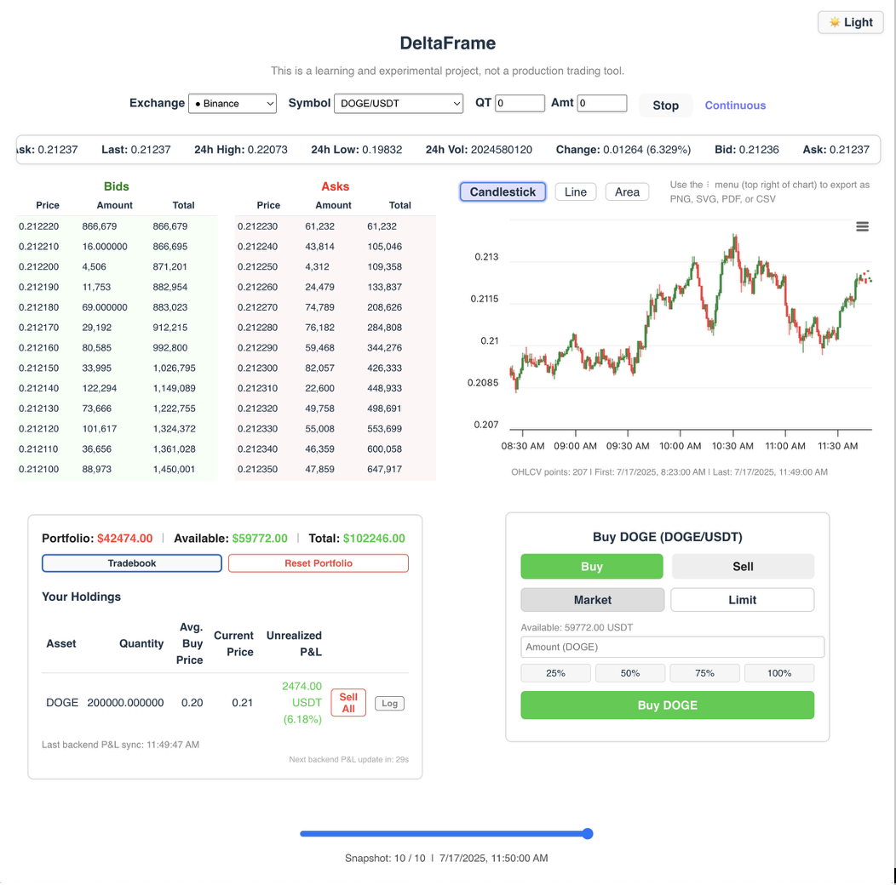

# DeltaFrame

**DeltaFrame** is an open-source, full-stack crypto order book and trading simulation app. It's not a finished product or professional trading tool—it's a sandbox for learning, experimenting, and chronicling my journey through fintech and full-stack development.

> TL;DR: Not a product. Not a tool. Just a chaotic fintech project(still underdevelopment) that taught me more than any tutorial ever could.

---

## Project Background & Learning Philosophy

This project follows the FAFO model (_"fuck around and find out"_)—learning by building, breaking things, and iterating. DeltaFrame represents the latest checkpoint in that ongoing process.

### Key Learning Milestones

- **CSV to SQLite:**  
  Started with CSVs for trade and portfolio storage—simple, transparent, but eventually too limiting. Migrated to SQLite with Sequelize for proper data modeling, transactional safety, and scalability.

- **Refined Holdings Logic:**  
  Originally used a `Holdings` table. Later removed it and now dynamically compute holdings from trade history to reduce redundancy and improve consistency.

- **Hybrid P&L Engine:**  
  Frontend calculates live P&L, but always verifies it against the backend (SQLite) as the source of truth. Any mismatches are logged and viewable in a modal for debugging and transparency.

- **UI: Brain First, Face Later:**  
  The UI is deliberately minimal. The backend and core logic are solid—the polish will come as the project matures.

---

## App Screenshot

*A user mid-DOGE trade. Features shown: live order book, simulated buy/sell panel, holdings tracker, backend-verified P&L.*

---

## Features

### Live Order Book
- Real-time order book data from supported **CCXT** exchanges and trading pairs.
- Manual fetch (user must click "Fetch").
- Placeholder UI when no data is loaded.

### Interactive Charting
- Candlestick, line, and area charts via **Highcharts**.
- Includes zoom, pan, export (PNG, SVG, PDF, CSV), and OHLCV tooltips.
- Fully responsive and supports light/dark mode.

### Trading Simulation
- Simulate buy/sell trades, tracked and persisted via SQLite.
- Holdings are computed on-the-fly from trade history.
- Buy/sell panel and cash balance always visible.

### Portfolio & P&L
- View holdings, trade history, and unrealized P&L live.
- **Hybrid P&L:** Frontend shows live P&L, backend verifies it.
- All desyncs are logged and viewable in a modal.
- Portfolio stats (cash, value, trades) are prominently displayed.

### Tradebook & Reset
- Tradebook and "Reset Portfolio" buttons built into the holdings UI.

### Defensive UX & Error Handling
- Helpful error messages and placeholder content.
- App won’t crash or go blank—even with bad/missing data.

### Minimal, Purpose-Driven UI
- Clean, responsive design focused on function first.
- Placeholder content guides users (e.g., “Click Fetch…”).
- Design polish will come after backend is fully mature.

---

## 🛠️ Technical Overview

| Layer     | Tech Stack                                 |
|-----------|--------------------------------------------|
| Frontend  | React (Vite), Highcharts, modern CSS, HTML |
| Backend   | Node.js, Express, Sequelize, SQLite        |

- **Data Flow:**
  - Backend: Fetches live market data via **CCXT**, handles trades and balance storage.
  - Frontend: Displays charts, order book, trading UI, and computed portfolio metrics.

- **Database Design:**
  - Tables: `Trades` and `Balance`.
  - Holdings are computed dynamically—no static `Holdings` table.
  - Legacy CSV logic has been removed entirely.

---

## Previous Projects

DeltaFrame builds on experiments from earlier stages:

- [orderbook-viewer (very early)](https://github.com/vedang-patil-23/orderbook-viewer)
- [orderbook-explorer (intermediate)](https://github.com/vedang-patil-23/orderbook-explorer)
- [orderbook-vision (UI-focused)](https://github.com/vedang-patil-23/orderbook-vision)

Each represents a distinct chapter of trial, error, and learning.

---

## Getting Started

1. Install dependencies in both backend and frontend:
   - `npm install` (in both `backend` and `frontend` directories)
2. Start the backend:
   - `cd backend && npm run dev` (or `node index.js`)
3. Start the frontend:
   - `cd frontend && npm run dev`
4. Open [http://localhost:5173](http://localhost:5173) in your browser.

---

## License
MIT (for learning and non-commercial use)

---

**Thank you for exploring DeltaFrame. If you have feedback, suggestions, or want to share your own learning journey, please reach out. This project is a work in progress, and so am I.** 